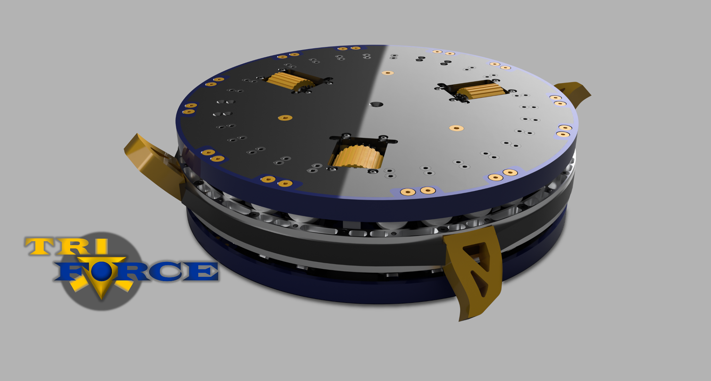

# Hardware Versions

## Triforce Jr. Jr. Jr.

This was an early prototype that unfortunately did not reach combat spec.
An off-the-shelf omni-mixer was demonstrated in this cardboard prototype.
We decided in the end to roll our own omni-mixer for Triforce Alpha.

## Triforce Alpha

The very first (semi)functional version of Triforce used a three-wheel omni-drive system.
We suffered a lot of teething issues with this, and shortly abbandoned the concept.
In the future we do hope to resurrect this drive method. We would much rather get a functional robot to start with, before investing considerable time into engineering
a heavyweight omni-drive system.

## Triforce Beta

